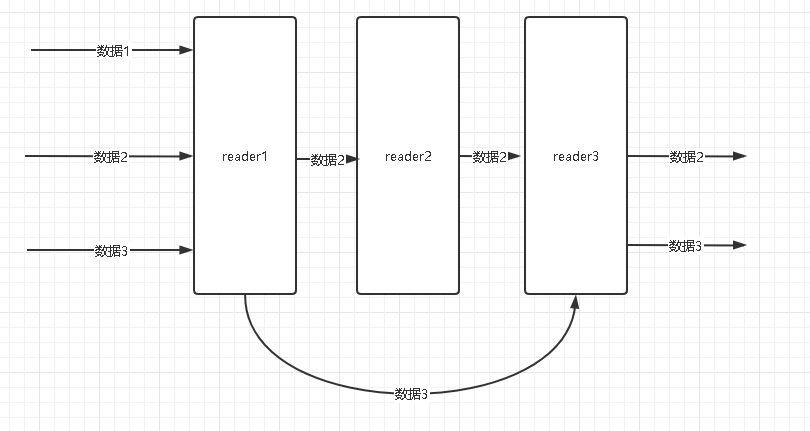

EasyReaderWriter
======================
## 一、简介
EasyReaderWriter是基于 [EasyExcel](https://github.com/alibaba/easyexcel) 再封装的工具，主要完善了Reader和Writer的创建、控制。



### 1、主要功能

* **[1]基于过滤器模式实现，能更加灵活得控制Reader(Writer)之间的调用**
* **[2]工厂模式创建Reader(Writer)更加简约，可拓展（结合Spring容器来注入等）**
* **[3]Reader(Writer)功能的解耦，可以组合不同Reader（Writer），提高代码复用性**
* **[4]Reader增加错误数据抛出接口、接收接口，Reader可以感知错误数据进行回调处理**
## 二、快速开始

详细参见test目录下的demo样例

```java
@SpringBootTest(classes = TestConfiguration.class)
@RunWith(SpringJUnit4ClassRunner.class)
public class ExcelTest {

    /**
     * 读取EXCEL并保存
     */
    @Test
    public void readAndSave() {
        ReadListenerChain<PersonXls> readListenerChain = EasyReaderWriter
                .initReadListener(PersonXls.class, SpringContextHolder::getPrototypeBean) // 工厂结合Spring可以实现监听器的依赖注入
                .initListener(new HashMap<String, Object>(4) {{ // 可以设置监听器的一些初始化属性
                    put(PersonSaveReadListener.INIT_THRESHOLD, 5);
                    put(ValidReadListener.INIT_ERR_MSG_FMT, "${rowIndex}行数据错误，原因：${errMsg}");
                }})
                .doValid(personXls -> {// 支持自手动校验数据和gsr303校验
                    if ("小王12".equals(personXls.getName())) {
                        return Collections.singletonList("不能为小王12");
                    }
                    return Collections.emptyList();
                })
                .ifHasErrData(errList -> {// 错误数据回调
                    System.out.println("校验出的错误数据===>" + errList);
                })
                .build();
        EasyExcel.read(getClass().getClassLoader().getResourceAsStream("人员信息.xlsx"), PersonXls.class, readListenerChain)
                .sheet()
                .doRead();
    }

    /**
     * 读取头和分页读取EXCEL
     */
    @Test
    public void readHeadAndReadPage(){
        LinkedList<String> headList = new LinkedList<>();
        ExcelPageInfo excelPageInfo = new ExcelPageInfo(5,10);
        ReadListenerChain<PersonXls> readListenerChain = EasyReaderWriter
                .initReadListener(PersonXls.class, SpringContextHolder::getPrototypeBean)// 工厂结合Spring可以实现监听器的依赖注入
                .initListener(new HashMap<String, Object>(4){{// 可以设置监听器的一些初始化属性
                    put(HeadReadListener.INIT_HEAD_LIST, headList);
                    put(PageReaderListener.INIT_PAGE, excelPageInfo);
                }})
                .addListener(HeadReadListener.class, 0)// 添加读头监听器
                .addListener(PageReaderListener.class, 0)// 添加分页读取监听器
                .build();

        EasyExcel.read(getClass().getClassLoader().getResourceAsStream("人员信息.xlsx"), PersonXls.class, readListenerChain)
                .sheet()
                .doRead();

        System.out.println("解析到的文件头===>" + headList);
        System.out.println("读取到的数据内容===>" + excelPageInfo.getPersonXlsList());
    }

    /**
     * 导出数据，冻住头及垂直合并相同字段
     */
    @Test
    public void freezeHeadAndMerge() throws IOException {
        List<PersonXls> personXlsList = getDemoDataList();

        WriteHandlerChainImpl writeHandlerChain = EasyReaderWriter
                .initWriteHandler(PersonXls.class, SpringContextHolder::getPrototypeBean)// 工厂结合Spring可以实现句柄的依赖注入
                .initHandler(Collections.singletonMap(CellMergeWriteHandler.INIT_DATA_SIZE, 10L))// 可以设置句柄的一些初始化属性
                .addHandler(FreezeHeadRowWriteHandler.class, 0)// 冻结头句柄
                .addHandler(CellMergeWriteHandler.class, 1)// 合并单元格句柄
                .build();

        File tempFile = File.createTempFile("freeze", ".xlsx");
        EasyExcel.write(tempFile, PersonXls.class)
                .excludeColumnFiledNames(Collections.singleton("errMsg"))
                .registerWriteHandler(writeHandlerChain)
                .sheet()
                .doWrite(personXlsList);
        System.out.println(tempFile);
    }
}
```